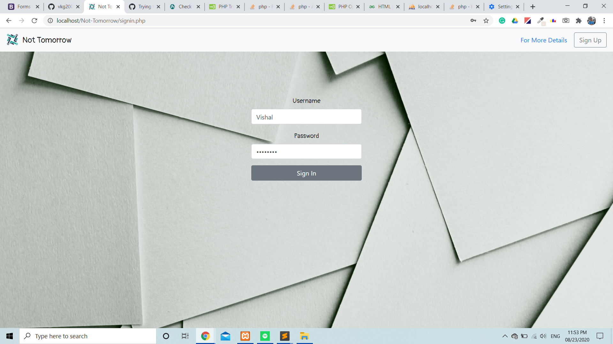

# Not-Tomorrow
A basic to-do list management webapp that help you to manage all your to-dos.
Sign Up and start adding your tasks.
  

          
## How it works 
Signup for a new account and start adding all your tasks.
If any task is done, click on the done button provided to rightmost in respective task's row.
To clear the task which is done from the to-do list, click on the clear button provided in front of respective strikethrough task. 
 
Active username is visible in to-do list block at right-topmost position.

&nbsp &nbsp 

## Brief Description
Front-End is made using HTML,Bootstarp and CSS.PHP has been used as server side language along with MYSQL as database.

#### Acknowledgment

 Huge thanks to the awesome StackOverflow Community
